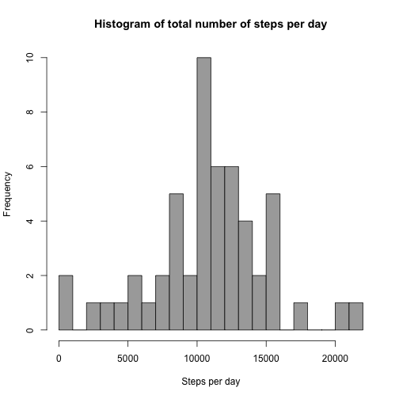
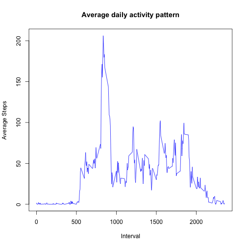
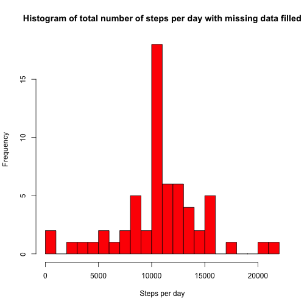
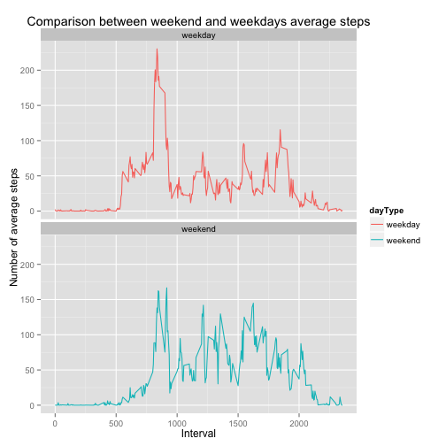

## Loading and preprocessing the data
The data is a csv file and must be downloaded and unzipped to the working directory first.


```r
rawData <- read.csv("activity.csv")
```


Transforms the data into a format more suitable for analysis


```r
rawData$date <- as.Date(rawData$date)
```

## Mean total number of steps taken per day
Calculate the total number of steps taken per day and save the results into a different data set


```r
sum_stepsByDate <- aggregate(steps ~ date, rawData, sum)
colnames(sum_stepsByDate) <- c("date", "steps")
```

Make a histogram of the total number of steps taken each day

```r
hist(
    sum_stepsByDate$steps, 
    col = 'darkgrey',  
    xlab = "Steps per day",
    main = "Histogram of total number of steps per day",
    breaks = 20 )
```

 

The mean of the total number of steps taken per day

```r
mean(sum_stepsByDate$steps)
```

```
## [1] 10766.19
```

And the median number of steps per day is

```r
median(sum_stepsByDate$steps)
```

```
## [1] 10765
```


## Average daily activity pattern

Aggregate the pattern for a day and draw the plot

```r
mean_stepsByInterval = aggregate(steps ~ interval, rawData, mean)
```

Draw the line plot to show the relationship

```r
plot(
    mean_stepsByInterval$interval, 
    mean_stepsByInterval$steps,
    type = "l", 
    col = "blue", 
    xlab = "Interval", 
    ylab = "Average Steps", 
    main = "Average daily activity pattern")
```

 

Find the 5 minute interval, on average across all days which contains the maximum number of steps

```r
max <- mean_stepsByInterval[mean_stepsByInterval$steps==max(mean_stepsByInterval$steps),]
max
```

```
##     interval    steps
## 104      835 206.1698
```

The 5 minute interval that gives the amount of steps is **835** with **206.1698113** steps

## Inputing missing values

Calculate the number of missing values in the data set

```r
missingRows <- sum(is.na(rawData$steps))
missingRows
```

```
## [1] 2304
```
There are 2304 rows that are missing values

Create a new dataset that is equal to the original data set but with the missing values added in. We shall use the mean from the 5 minutes interval to replace the missing values.

Let's create a function to get the mean steps for a particular 5 minute interval

```r
getMeanSteps <- function(interval){
    mean_stepsByInterval[mean_stepsByInterval$interval == interval, ]$steps
}
```

Then create a new data set having the original dataset but with missing values replaced.

```r
# create a copy of the original data set
completeData <- rawData

# set the row count
count <- 0
# loop through every row in the data set
for(i in 1:nrow(completeData)){
    # if the row is missing a value
    if(is.na(completeData[i,]$steps)){
        # replace the steps with the 5 minute interval
        completeData[i,]$steps <- getMeanSteps(completeData[i,]$interval)
        count <- count + 1
    }
}
```

2304 rows with NA values replaced

Draw a histogram of the complete data set

```r
sum_StepsByDate_Complete <- aggregate(steps ~ date, completeData, sum)
hist(
    sum_StepsByDate_Complete$steps, 
    col = 'red', 
    xlab = "Steps per day", 
    main = "Histogram of total number of steps per day with missing data filled",
    breaks = 20)
```

 

Calculate the mean of steps in the complete data set

```r
mean(sum_StepsByDate_Complete$steps)
```

```
## [1] 10766.19
```

Calculate the median of steps

```r
median(sum_StepsByDate_Complete$steps)
```

```
## [1] 10766.19
```

The mean values between the raw dataset and complete data set are the same. This is because we are using the mean value for that missing 5 minute interval. 

There is a *small* change in median values. The median value and mean value of the complete data set are now the same.

## Are there differences in activity patterns betwen weekdays and weekends?

Using the dataset with filled in missing values, create a new factor variable in the dataset with two levels - "weekday" and "weekend" indicating whether a given date is a weekday or weekend day.


```r
# Add a factor variable to the complete data set to indicate weekdays or weekends
completeData$dayType <- factor((weekdays(completeData$date) %in% c('Saturday','Sunday')), levels=c(FALSE, TRUE), labels=c('weekday', 'weekend'))
```

Make a panel plot containing a time series plot (i.e. type = "l") of the 5-minute interval (x-axis) and the average number of steps taken, averaged across all weekday days or weekend days (y-axis).


```r
library(ggplot2)

# aggregate the data
mean_stepsByInterval_Complete <- aggregate(steps ~ interval+dayType, data = completeData, mean)

qplot(
    interval,
    steps,
    data = mean_stepsByInterval_Complete,
    col = dayType,
    geom = "line",
    xlab = "Interval",
    ylab = "Number of average steps",
    main = "Comparison between weekend and weekdays average steps"
) + facet_wrap(~dayType, ncol = 1)
```

 

There are differences between weekdays and weekend steps pattern. Mosf of the steps during weekdays are concentrated during the morning hours, with smaller peaks during the afternoon. Activity during weekends tends to start later and are more consistent throughout the day.

